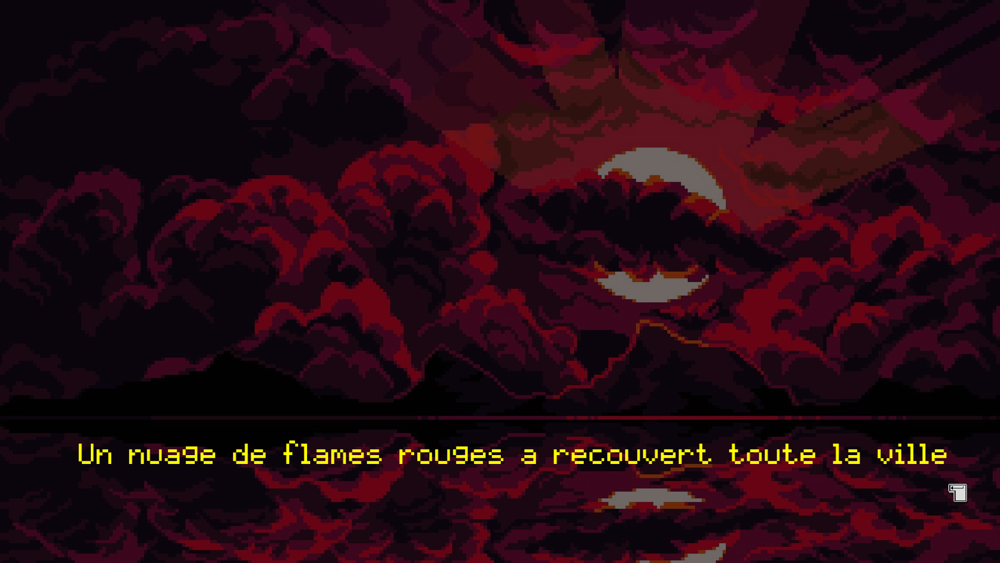
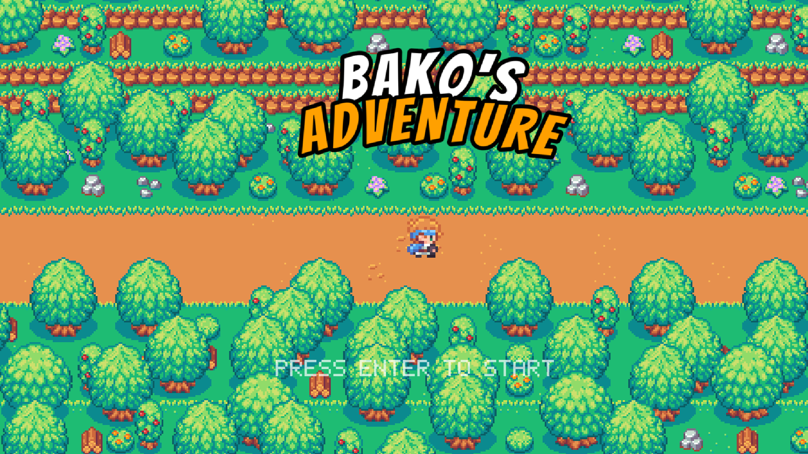
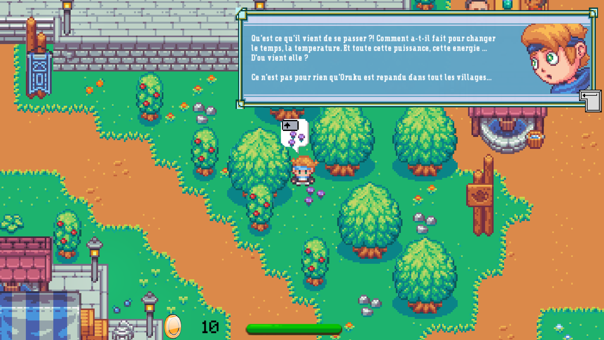
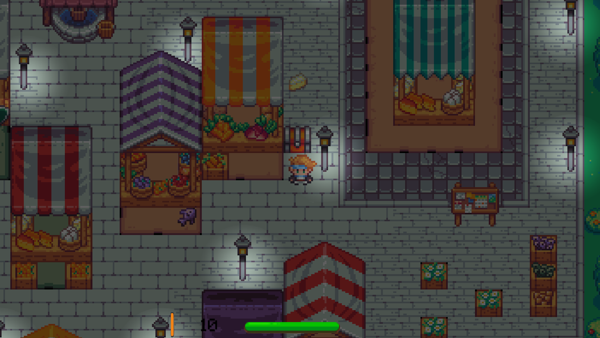

# My RPG 🌌

Welcome to **My RPG**.

An ambitious and creative project.

This is your chance to bring to life an RPG that encapsulates everything you've learned and more.

## Language and Tools 🛠️

- **Language:** C
- **Framework:** SFML (Simple and Fast Multimedia Library)
- **Compilation:** Via Makefile, including `re`, `clean`, and `fclean` rules.
- **Binary Name:** my_rpg

## Project Overview 🔎

**My RPG** is not just a game; it's a journey into the realm of fantasy and adventure. You are tasked with creating a comprehensive RPG experience complete with a compelling storyline, engaging gameplay mechanics, and a richly detailed world.

## Game Features 🎮

- **Character Customization:** Players can create and develop their character, complete with unique characteristics and abilities.
- **Combat System:** Engaging fight mechanics against a variety of enemies, with outcomes influenced by player stats.
- **NPC Interactions:** In-depth interactions with NPCs, including quests, dialogues, and trades.
- **Quest System:** At least one main quest driving the storyline, alongside various side quests.
- **Inventory Management:** A detailed inventory system to manage a limited set of items.
- **Experience and Leveling:** Players gain experience through battles and quests, leveling up and enhancing their stats.
- **Polished UI:** A user-friendly and aesthetically pleasing interface.
- **Coherent Universe:** Consistent and immersive visual and audio assets, forming a believable and engaging game world.

### Technical Requirements

- **Collision System:** Incorporating both static and dynamic elements.
- **Particle System:** At least two types of particle effects for realistic environmental simulation.
- **Camera Controls:** Zoom, translation, and rotation functionalities.
- **3D Effects:** Depth scaling and isometric projection for an enhanced visual experience.

### Essential Mechanics

- **Starting Menu:** With options to start or quit the game.
- **Pause Menu:** Accessible via an escape key with options to resume or exit.
- **Inventory and Status Menus:** For in-depth player and game management.

## Gameplay 🕹️

Dive into an adventure where every decision, battle, and interaction shapes your journey. From battling formidable foes to unraveling mysteries through quests, **My RPG** offers a complete fantasy experience.

## Game Preview 📸

Embark on a journey filled with magic, mystery, and adventure in **My RPG**. Below are glimpses of the dynamic gameplay, vivid environments, and diverse attack types that await you:

- 
- 
- 
- 

### Attack Types

Experience the thrill and strategy of combat with a variety of attack types:

- 
- 
- 
- 

### Teleportation

Experience the Teleportation power:
- 

## Bako's Adventure in My RPG 🗺️

### Usage

#### Options

- `-h`: Print usage.

### Settings

- **Sound**: Toggle sound/music in the game.

### Key Interactions

- **Escape**: Exit game.
- **Z & Up**: Move player up.
- **Q & Left**: Move player left.
- **S & Down**: Move player down.
- **D & Right**: Move player right.
- **I**: Open inventory.

### Key Aspects of Bako's Adventure

Embark on an immersive adventure in the world of Akrapovich, a realm filled with mystery and intrigue. The journey begins with a captivating mini-film, setting the stage for the epic tale that unfolds:

- **Mini-Film at the Beginning:** The game opens with a beautifully crafted mini-film that introduces players to the world of Akrapovich, its lore, and the overarching narrative of the adventure.

### The World of Akrapovich

- **NPCs:** Interact with various NPCs who offer quests and provide vital information, enriching your journey with diverse stories and tasks.
- **Quests:** Engage in multi-step quests with multiple outcomes, each choice influencing the direction of your adventure.
- **Final Fight:** Brace yourself for a climactic battle at the end of your journey, testing your skills and strategies acquired along the way.
- **Inventory Management:** Press "I" to manage and view items in your inventory, including weapons and quest collectibles.
- **Items Discovery:** Find or receive items from NPCs or hidden throughout the map, each playing a crucial role in your journey.
- **Exploration:** Explore the beautifully crafted world of Akrapovich, filled with secrets to uncover and landscapes to marvel at.

As you navigate through the world of Akrapovich, each element, from the NPCs to the sprawling landscapes, contributes to a rich, immersive RPG experience.

## Installation and Usage 💾

1. Clone the repository.
2. Compile the game using `make`.
3. Start your adventure with `./my_rpg`.
4. Refer to `my_rpg.pdf` for in-depth gameplay guidelines.

## License ⚖️

This project is released under the MIT License. See `LICENSE` for more details.

